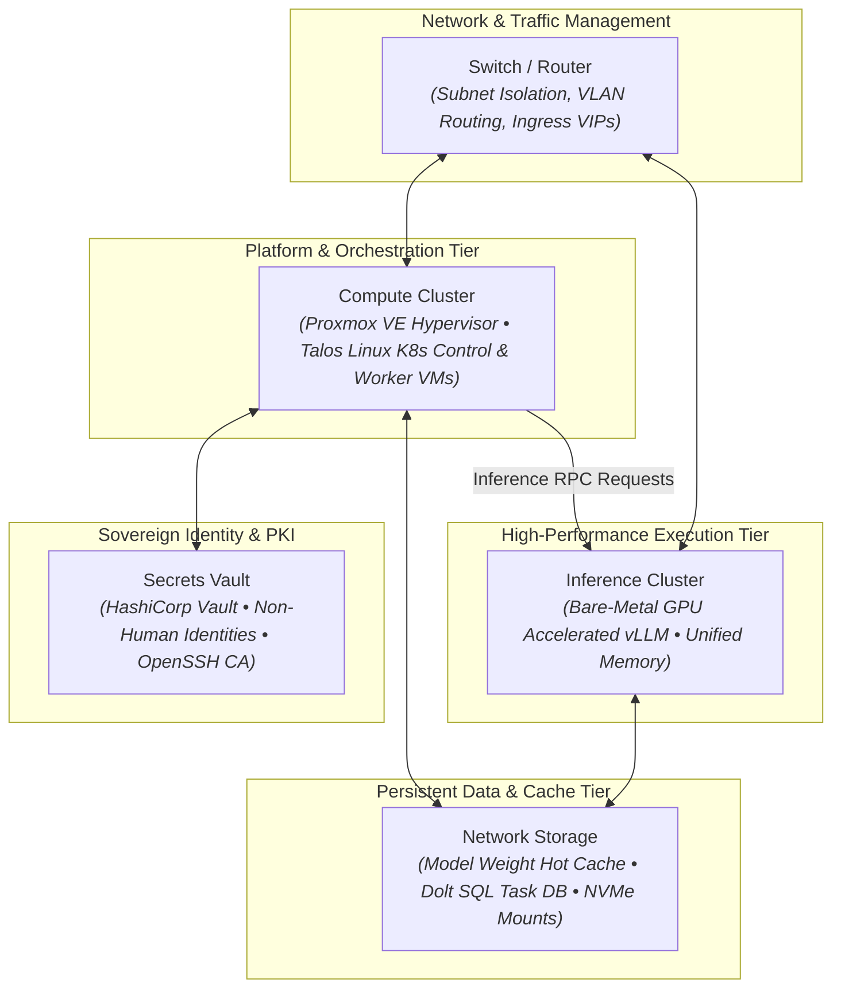

# Suitcase AI: Ultra-Compact Sovereign AI Cluster & Agent Factory


**Suitcase AI** is an open-source engineering blueprint and reference
implementation for a complete, self-contained AI agent factory and compute
cluster housed in an ultra-compact 10" mini-rack form factor.

Engineered for a homelab with an eye towards future field mobility, austere
environments, and edge operational autonomy, Suitcase AI executes multi-agent
reasoning, local model serving, vector indexing, and GitOps workflows **100%
offline and air-gapped**, with optional WAN egress through intelligent proxy
fallbacks.

---

<a id="functional-architecture-topology"></a>

## 🏗️ Functional Architecture Topology

The functional architecture cleanly decouples model execution, orchestration,
persistent state, and identity:



---

<a id="operational-status-as-built-baseline"></a>

## 📊 Operational Status: As-Built Baseline

The following capabilities are **currently deployed, verified, and active** on
physical hardware:

### Physical 10" Mini-Rack Elevation (Current Deployment)

```text
┌─────────────────────────────────────────────────────────────┐
│ 8U 10" Mini-Rack (axiopaladin/ButterflyRack w/ Metal Rails) │
├─────┬───────────────────────────────────────────────────────┤
│ 8U  │ [ Upper Convective Airflow & Cable Slack Clearance ]   │
├─────┼───────────────────────────────────────────────────────┤
│ 7U  │ ASUS Ascent GX10 (NVIDIA GB10 Superchip, 128GB Unified│
│     │ Memory) + 4TB USB NVMe SSD (Local Model Weight Cache) │
├─────┼───────────────────────────────────────────────────────┤
│ 6U  │ 14-Port Patch Panel                                   │
├─────┼───────────────────────────────────────────────────────┤
│ 5U  │ 1G Managed Switch (Native VLAN 82 Management Fabric)  │
├─────┼───────────────────────────────────────────────────────┤
│ 3-4U│ Minisforum UM760 Slim (AMD Ryzen 5 7640HS, 32GB DDR5) │
│     │ [ Proxmox VE 9.2 Hypervisor • colt-cp-01 ]            │
├─────┼───────────────────────────────────────────────────────┤
│ 1-2U│ [ Base Shelf / PDU Power Distribution & Bricks ]      │
└─────┴───────────────────────────────────────────────────────┘
```

### 1. Compute & Acceleration Nodes

- **Hypervisor Host (`colt-cp-01`)**: **Minisforum UM760 Slim** (AMD Ryzen 5
  7640HS with 6 Cores / 12 Threads up to 5.0 GHz, 32GB DDR5 5600MHz RAM, 1TB
  PCIe 4.0 NVMe SSD, 2.5GbE LAN) active on `10.82.0.2` running Proxmox VE 9.2
  (`pve-manager/9.2.5`, Linux kernel `7.0.14-6-pve`).
- **AI Acceleration Host (`colt-gpu-01`)**: **ASUS Ascent GX10** active on
  `10.82.0.3` running NVIDIA DGX OS with unified memory architecture housing the
  **NVIDIA GB10 Superchip (128GB unified memory)** paired with an external 4TB
  USB NVMe SSD for high-throughput model weight storage.
- **Physical Network Fabric**: Dedicated physical links operating on the native
  Camp Colt subnet (`10.82.0.0/24`, VLAN 82) with verified sub-1.3ms
  host-to-host latency.

### 2. Identity & Access Governance (Non-Human Identities)

- **Zero-Standing Root Policy**: Host administrative duties are handled by
  dedicated Non-Human Identity (NHI) accounts (`colt-sysadmin-agent`), strictly
  eliminating direct root logins or shared personal keys.
- **OpenSSH CA Authentication**: Host access is governed by an OpenSSH
  Certificate Authority anchored to a physical hardware security key (YubiKey).
  Short-lived cryptographic certificates grant explicit principals
  (`colt-sysadmin-agent`, `colt-sysadmin`) without requiring continuous human
  touches during routine operations.
- **Auditable Least Privilege**: Scoped sudoers rules
  (`/etc/sudoers.d/99-colt-sysadmin-agent`) permit declarative infrastructure
  management while preventing unauthorized shell escapes.

### 3. Sovereign Secrets Management

- **Local Vault Instance (`colt-vault`)**: Deployed in isolated Proxmox LXC
  Container ID 9190 (`10.82.0.5:8200`), running HashiCorp Vault v2.1.
- **State**: Fully initialized and unsealed, providing encrypted-at-rest
  credential storage, local PKI certificate generation, and token management
  without external cloud dependencies.

---

## ⚙️ Hardware Specifications & Bill of Materials

The cluster is engineered to run on standard **120V / 15A household or portable
generator circuits** while remaining under strict acoustic and thermal ceilings:

| Component             | Hardware Model                                                     | Key Specifications                                   | Role in Cluster                        |  Status   |
| :-------------------- | :----------------------------------------------------------------- | :--------------------------------------------------- | :------------------------------------- | :-------: |
| **Chassis**           | [ButterflyRack](https://github.com/axiopaladin/ButterflyRack) (8U) | Modular 3D-printable 10" rack with metal rack rails  | Structural cluster housing             | 🟢 Active |
| **GPU Node**          | ASUS Ascent GX10                                                   | NVIDIA Grace Blackwell GB10, 128GB Unified Memory    | Local LLM inference & embeddings       | 🟢 Active |
| **Model Hot Cache**   | 4TB USB NVMe SSD                                                   | USB 3.2 Gen2 (10Gbps) External NVMe Drive            | Fast model weights storage for GX10    | 🟢 Active |
| **Hypervisor Host**   | Minisforum UM760 Slim                                              | AMD Ryzen 5 7640HS, 32GB DDR5 5600, 1TB NVMe, 2.5GbE | Proxmox VE, K8s VMs, Vault LXC         | 🟢 Active |
| **Network Switch**    | 1G Managed Switch                                                  | 8-Port Managed Switch (VLAN 82, MTU 9000)            | Data Plane & Management Fabric         | 🟢 Active |
| **Secrets Engine**    | Proxmox LXC 9190                                                   | HashiCorp Vault 2.1 on Debian 12 Minimal             | Local PKI & Non-Human Identity auth    | 🟢 Active |
| **K8s Control Plane** | Talos Linux VM 9110                                                | 2 vCPU, 4GB RAM, 40GB NVMe (`10.82.20.2`)            | Immutable Kubernetes Control Plane     | 🟡 Staged |
| **K8s Worker**        | Talos Linux VM 9120                                                | 4 vCPU, 12GB RAM, 100GB NVMe (`10.82.20.13`)         | Platform workloads, Dolt, Ingress VIPs | 🟡 Staged |

---

## 🔒 Security Architecture & Zero-Secret Governance

Suitcase AI enforces a **Zero-Secret Security Model** designed
to prevent prompt injection credential extraction, accidental git leaks, and
privilege creep:

1. **The Zero-Secret Rule**: Agents, swarms, and LLM reasoning engines never
   receive, handle, or store raw API keys, root passwords, or SSH private keys.
   All external credentials reside in encrypted vaults and are injected at
   runtime via declarative transport proxies.
2. **Hardware Root of Trust**: Administrative trust roots reside on physical
   hardware security tokens (YubiKey). Routine operations execute using
   machine-minted Ed25519 certificates signed by the hardware CA, preventing
   prompt fatigue.
3. **Immutable Operating Systems**: Kubernetes nodes utilize **Talos Linux**—an
   immutable, API-driven Linux distribution devoid of SSH, shell utilities, or
   interactive package managers, dramatically reducing the host attack surface.

---

## 🗺️ Project Roadmap & Phased Execution

Suitcase AI follows a phased engineering roadmap with distinct milestones:

```text
┌────────────────────────────────────────────────────────────────────────┐
│ Phase 1: Physical Underlay & Sovereign Security Baseline    [COMPLETED]│
├────────────────────────────────────────────────────────────────────────┤
│ • [x] 10" Rack layout, physical cabling, and convective thermal paths  │
│ • [x] Native Camp Colt network cutover (10.82.0.0/24 — VLAN 82)        │
│ • [x] OpenSSH CA identity architecture & Non-Human Identity onboarding │
│ • [x] Sovereign HashiCorp Vault deployment (LXC 9190 @ 10.82.0.5)      │
├────────────────────────────────────────────────────────────────────────┤
│ Phase 2: Tactical Kubernetes Cluster & Platform Services   [IN ACTIVE] │
├────────────────────────────────────────────────────────────────────────┤
│ • [ ] Bootstrap Talos Linux Control Plane (colt-control-01 @ .20.2)    │
│ • [ ] Bootstrap Talos Linux Worker (colt-worker-01 @ .20.13)           │
│ • [ ] Deploy MetalLB Ingress VIP pool (10.82.50.0/24)                  │
│ • [ ] Deploy LiteLLM Proxy Gateway & Dolt SQL Task Database VIPs       │
│ • [ ] Decommission legacy Fog transition containers (reclaim 16GB RAM) │
├────────────────────────────────────────────────────────────────────────┤
│ Phase 3: Hardware Expansion & Multi-Node Scale              [PLANNED]  │
├────────────────────────────────────────────────────────────────────────┤
│ • [ ] Flush 9U front-panel HMI console (7" Touch LCD + ReSpeaker mic)  │
└────────────────────────────────────────────────────────────────────────┘
```

---

## 📂 Repository Structure

```text
├── README.md              # Project overview and public architecture guide
├── hardware/              # 10" rack CAD, power budget, thermals, and BOM
├── plans/                 # Product requirements, cutover runbooks, and specs
│   ├── prd.md             # Core Product Requirements Document
│   └── 0.1/               # Phase 0.1 execution runbooks & verified network plans
├── software/              # Talos Linux configs, Proxmox specs, and Helm values
├── scripts/               # Host provisioning and certificate signing utilities
│   ├── sign_agent_cert.sh # Parameterized OpenSSH CA certificate issuance tool
│   └── provision_host.sh  # Automated host onboarding script
└── tools/                 # Operational CLI utilities
```

---

## 📜 License

This project is licensed under the Apache 2.0 License.
