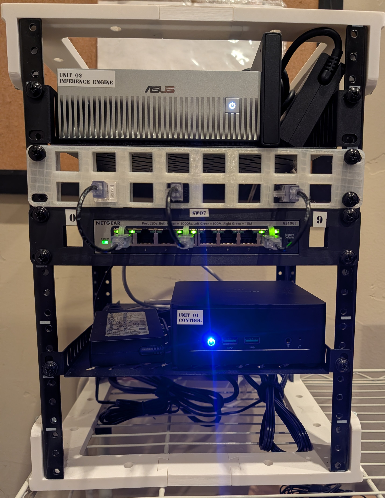

# Suitcase AI (Camp Colt)

## 💡 Executive Summary & Background

> _"When you leave Google, the first thing you lose is the illusion of infinite, free compute. Suddenly, every token has an invoice attached to it... I wanted a self-contained, portable, sovereign compute node rather than a giant rack in a server closet."_
> — Read the accompanying architectural essay: [**"Why I Spent $5,000 on Hardware Instead of Tokens"**](https://showmetheinference.com/posts/why-i-spent-5000-on-hardware-instead-of-tokens/) by Nick Chalko.

**Suitcase AI** is a production-grade, sovereign AI appliance engineered to run autonomous multi-agent systems and frontier open weights locally. Operating within a standard North American **120V / 15A residential circuit (~297W peak)**, it combines an **ASUS Ascent GX10** (NVIDIA Grace Blackwell GB10 with 128GB unified memory) with an energy-efficient **Minisforum UM760 Slim** x86 control plane in an ultra-compact 8U 10-inch mini-rack.

---

## 🧭 What This Project Is

This repository contains the Terraform manifests, Ansible playbooks, and security configurations used to manage **Camp Colt**—a self-contained homelab compute cluster built into an 8U 10-inch mini-rack.

The goal is a compact, power-efficient, and quiet homelab setup designed to run on a standard 120V / 15A household circuit while supporting:

- **Immutable Kubernetes:** Talos Linux nodes configured purely via API (no in-guest SSH or package managers).
- **Zero-Standing Secrets:** Host access via ephemeral OpenSSH CA client certificates signed by HashiCorp Vault.
- **Local AI Acceleration:** Dedicated NVIDIA Grace Blackwell node paired with low-power x86 hypervisor compute.

---

## 🛠️ Physical 10" Mini-Rack Layout

The cluster is housed in a 3D-printed 10-inch modular rack ([ButterflyRack](https://github.com/axiopaladin/ButterflyRack)):

<table>
<tr>
<td width="48%" valign="top">



</td>
<td width="52%" valign="top">

```text
┌─────────────────────────────────────────────────────────────┐
│ 8U 10" Mini-Rack (axiopaladin/ButterflyRack w/ Metal Rails) │
├─────┬───────────────────────────────────────────────────────┤
│ 7-8U│ ASUS Ascent GX10 (NVIDIA Grace Blackwell GB10, 128GB) │
│     │ + 4TB USB NVMe SSD (Local Model Weight Cache)         │
├─────┼───────────────────────────────────────────────────────┤
│ 6U  │ 14-Port Keystone Patch Panel                          │
├─────┼───────────────────────────────────────────────────────┤
│ 5U  │ 1G Managed Switch (10.82.0.0/16 Network Fabric)       │
├─────┼───────────────────────────────────────────────────────┤
│ 3-4U│ Minisforum UM760 Slim (AMD Ryzen 5 7640HS, 32GB DDR5) │
│     │ [ Proxmox VE 9.2 Hypervisor • colt-cp-01 ]            │
├─────┼───────────────────────────────────────────────────────┤
│ 1-2U│ [ Base Shelf / PDU Power Distribution & Bricks ]      │
└─────┴───────────────────────────────────────────────────────┘
```

</td>
</tr>
</table>

### Physical Hardware Bill of Materials

| Component              | Hardware Model                                                | Key Specifications                                  | Physical Role                                          |   State   |
| :--------------------- | :------------------------------------------------------------ | :-------------------------------------------------- | :----------------------------------------------------- | :-------: |
| **Chassis**            | [ButterflyRack](https://github.com/axiopaladin/ButterflyRack) | 8U 10" mini-rack with metal rails                   | Structural enclosure                                   | 🟢 Active |
| **GPU Node**           | ASUS Ascent GX10                                              | NVIDIA Grace Blackwell GB10, 128GB unified RAM      | GPU inference host (`colt-gpu-01` @ `10.82.0.3`)       | 🟢 Active |
| **Model Storage**      | 4TB USB NVMe SSD                                              | USB 3.2 Gen2 (10Gbps) external drive                | High-throughput local model cache                      | 🟢 Active |
| **Patch Panel**        | 14-Port Keystone Panel                                        | Cat6 RJ-45 couplers                                 | Patching & service isolation                           | 🟢 Active |
| **Network Switch**     | 1G Managed Switch                                             | 8-port switch (`10.82.0.0/16`, gateway `10.82.0.1`) | Management & data underlay                             | 🟢 Active |
| **Hypervisor Host**    | Minisforum UM760 Slim                                         | AMD Ryzen 5 7640HS, 32GB DDR5, 1TB NVMe, 2.5GbE     | Proxmox VE 9.2 hypervisor (`colt-cp-01` @ `10.82.0.2`) | 🟢 Active |
| **Power Distribution** | PDU Shelf                                                     | Multi-outlet distribution + OEM power supplies      | AC power distribution (120V / 15A circuit)             | 🟢 Active |

---

### Bare-Metal Fleet Hosts

| Hostname          | Hardware Platform     | Role                                   | IP Address  | Operating System      | Access Method                      |  Status   |
| :---------------- | :-------------------- | :------------------------------------- | :---------- | :-------------------- | :--------------------------------- | :-------: |
| **`colt-cp-01`**  | Minisforum UM760 Slim | Hypervisor Host (VMs, Storage, Vault)  | `10.82.0.2` | Proxmox VE 9.2        | OpenSSH CA (`colt-sysadmin-agent`) | 🟢 Active |
| **`colt-gpu-01`** | ASUS Ascent GX10      | Inference Accelerator (K8s GPU Worker) | `10.82.0.3` | DGX OS (Ubuntu Arm64) | OpenSSH CA (`colt-sysadmin-agent`) | 🟢 Active |

> [!NOTE]
> All Kubernetes control plane and general compute workloads run on immutable, API-driven **Talos Linux** virtual machines on `colt-cp-01`. The bare-metal ASUS GX10 runs **NVIDIA DGX OS** and joins the cluster as an accelerated Kubernetes worker node via the official NVIDIA GPU Operator / Device Plugin.

---

All virtual infrastructure is provisioned declaratively on `colt-cp-01` via Terraform:

| ID            | Name              | Type           | Allocated Resources          | Network / Endpoint        | Role                                    |   State   |
| :------------ | :---------------- | :------------- | :--------------------------- | :------------------------ | :-------------------------------------- | :-------: |
| **CT 9190**   | `colt-vault`      | Debian 12 LXC  | 1 vCPU, 1GB RAM, 8GB disk    | `https://10.82.0.5:8200`  | HashiCorp Vault 2.1 (mTLS & OpenSSH CA) | 🟢 Active |
| **VM 9110**   | `colt-control-01` | Talos Linux VM | 2 vCPU, 2.5GB RAM, 30GB NVMe | `https://10.82.0.10:6443` | `camp-colt-k8s` Control Plane (v1.36.4) | 🟢 Active |
| **VM 9120**   | `colt-worker-01`  | Talos Linux VM | 4 vCPU, 6GB RAM, 100GB NVMe  | `10.82.0.13`              | Workload execution & Ingress (v1.36.4)  | 🟢 Active |
| **Baremetal** | `colt-gpu-01`     | DGX OS Arm64   | 20 CPU, 128GB Unified, GB10  | `10.82.0.3`               | `camp-colt-k8s` GPU Node (v1.36.4)      | 🟢 Active |

---

## 🔄 Sovereign GitOps Delivery (Flux CD & In-Cluster Gitea)

Cluster workloads, platform controllers, and ingress configurations are continuously reconciled via **Flux CD** pulling directly from the sovereign, in-cluster **Gitea** Git forge:

| Workload / Service  | Type              | Delivery Engine  | Endpoint / Access                  | Role & Storage                                    |   State   |
| :------------------ | :---------------- | :--------------- | :--------------------------------- | :------------------------------------------------ | :-------: |
| **`gitea`**         | K8s Deployment    | GitOps (Flux CD) | `http://10.82.0.13/colt` (`:3000`) | Sovereign Git Forge (20GB NVMe `local-path`)      | 🟢 Active |
| **`flux-system`**   | GitOps Controller | Self-Managed     | In-Cluster (`flux-system`)         | Continuous reconciliation of `clusters/camp-colt` | 🟢 Active |
| **`ingress-nginx`** | K8s DaemonSet     | GitOps (Flux CD) | `10.82.0.13` (Ports 80/443)        | Edge ingress pinned to `talos-64r-bft` worker     | 🟢 Active |

### Key GitOps Elements

- **Forge URL:** `http://10.82.0.13/colt/suitcase-ai.git` (in-cluster: `http://gitea.gitea.svc.cluster.local:3000/colt/suitcase-ai.git`)
- **CLI Management:** `tea` CLI configured with default `colt` profile
- **Source Sync:** `GitRepository/flux-system` polls in-cluster Gitea `main` branch
- **Root Manifests:** [`clusters/camp-colt/`](file:///home/luna-mayor-agent/luna/rigs/suitcase-ai/clusters/camp-colt/) and [`provision/k8s/`](file:///home/luna-mayor-agent/luna/rigs/suitcase-ai/provision/k8s/)

---

## 📐 Architecture & Core Design Decisions

The appliance architecture embodies five foundational engineering pillars:

1. **Zero Standing Secrets:**
   - Host administration utilizes short-lived (1-hour) OpenSSH client certificates minted on demand by HashiCorp Vault (`colt-vault`).
   - Workload secrets, automated mTLS, and registry tokens are managed dynamically with zero raw credentials or private keys ever committed to Git.
2. **Immutable Infrastructure:**
   - Kubernetes nodes run immutable [Talos Linux](https://www.talos.dev/) operated purely via declarative API (`talosctl` and Terraform).
   - VMs have zero in-guest SSH daemons, shells, or package managers, eliminating configuration drift and attack surfaces.
3. **Sovereign GitOps:**
   - Continuous reconciliation via Flux CD backed by our self-hosted, in-cluster Gitea Git forge (`http://10.82.0.13/colt`).
   - Cluster workloads and operational configurations run completely self-contained and air-gapped from cloud dependencies.
4. **Certified 3-2-1 Disaster Recovery:**
   - Automated Kopia snapshots for persistent state (Vault Raft, Gitea, Harbor, Dolt, and LiteLLM) backed by grandfather-father-son (GFS) retention schedules.
   - Dual-tier backup topology syncing locally to fast appliance storage and off-site to client-side encrypted cloud targets, verified by periodic recovery drills ([`docs/GITEA_DISASTER_RECOVERY.md`](file:///home/luna-mayor-agent/luna/rigs/suitcase-ai/docs/GITEA_DISASTER_RECOVERY.md)).
5. **Sub-300W Power Efficiency:**
   - Peak synthetic inference draw across the entire appliance remains strictly under 300W (~297W / 2.5A @ 120V): `colt-gpu-01` (~220W peak), `colt-cp-01` (~65W peak), network switch (~4W peak), and NVMe cache (~8W peak).
   - Runs comfortably on standard North American 120V / 15A residential circuits, portable generators, or compact UPS batteries.
   - Passive and convective chimney airflow design within the 8U 10-inch form factor maintains low noise and reliable thermal margins.

---

## 🌫️ Fog Legacy Workloads (Co-located)

Personal homelab workloads that ideally belong on separate physical hardware, but are co-located on `colt-cp-01` to make the best use of available physical capacity:

- **Segregated Management:** Allocations are declared in [`provision/fog/`](file:///home/luna-mayor-agent/luna/rigs/suitcase-ai/provision/fog/) for hypervisor tracking, but in-guest OS configurations and application workloads are managed externally.
- **Network Isolation:** All Fog resources run on a dedicated, isolated VLAN (**VLAN 613** on `10.7.82.0/24`) and do not route into the Camp Colt `10.82.0.0/16` fabric.

| VMID        | Guest Name       | Type           | Allocated Resources          | Network                 | Role                         |
| :---------- | :--------------- | :------------- | :--------------------------- | :---------------------- | :--------------------------- |
| **CT 9090** | `vault`          | Debian 12 LXC  | 1 vCPU, 1GB RAM, 16GB disk   | `10.7.82.90` (VLAN 613) | Fog Vault & Root CA          |
| **VM 9010** | `k8s-control-01` | Talos Linux VM | 2 vCPU, 4GB RAM, 40GB disk   | `10.7.82.15` (VLAN 613) | Fog Kubernetes Control Plane |
| **VM 9020** | `k8s-worker-01`  | Talos Linux VM | 6 vCPU, 12GB RAM, 150GB disk | `10.7.82.16` (VLAN 613) | Fog Kubernetes Worker        |

---

## 🚀 Operations Quickstart

### Prerequisites

- Tools: `terraform`, `kubectl`, `talosctl`, `vault` CLI
- Network connectivity to the `10.82.0.0/16` management subnet

### 1. Load Environment

```bash
# Exports Proxmox VE API tokens and local Vault environment
source scripts/load_colt_env.sh
```

### 2. Manage Infrastructure via Terraform

```bash
# Check current planned state
terraform -chdir=provision plan

# Apply infrastructure changes (Hypervisor VMs, Vault LXC, Talos configs)
terraform -chdir=provision apply
```

### 3. Access Kubernetes Cluster

```bash
# Set kubeconfig to Camp Colt cluster
export KUBECONFIG="$(pwd)/colt-kubeconfig"

# Verify cluster status
kubectl get nodes -o wide
kubectl get pods -A
```

### 4. Administer Hypervisors via Ephemeral SSH Certificate

```bash
# Mint a 1-hour signed certificate from Vault
./scripts/sign_agent_cert.sh ~/.ssh/id_ed25519

# SSH to hypervisor using signed certificate
./scripts/ssh_colt_cp.sh
```

---

## 📂 Repository Layout

```text
├── AGENTS.md              # Operational roles, guidelines, and agent instructions
├── README.md              # Project overview, hardware layout, and quickstart
├── agent-keys/            # Public keys, OpenSSH CA certs, and identity records
│   ├── agents/            # Non-Human Identity public keys (colt-sysadmin)
│   └── vault/             # Vault SSH CA public keys
├── docs/                  # Operational runbooks and architecture deep-dives
│   ├── HARDWARE.md        # Physical packaging, CAD models, thermals, and power
│   ├── PROXMOX_OPERATIONS.md
│   └── SECURITY.md        # OpenSSH CA, Non-Human Identity, and trust configuration
├── plans/                 # Architecture implementation and cutover plans
│   └── completed/         # Archival of completed bootstrap runbooks
├── provision/             # Declarative Terraform manifests
│   ├── colt_talos.tf      # Talos Linux Kubernetes cluster definitions
│   ├── colt_vault.tf      # HashiCorp Vault LXC definition
│   ├── colt_vms.tf        # Proxmox QEMU virtual machine resources
│   ├── colt_variables.tf  # Network, VMID, and compute sizing variables
│   ├── ansible/           # Ansible playbooks and inventory
│   └── fog/               # Segregated hypervisor definitions for legacy Fog
└── scripts/               # Host onboarding, CA signing, and environment scripts
    ├── load_colt_env.sh   # Environment loader for Vault and Proxmox API
    ├── sign_agent_cert.sh # Parameterized OpenSSH CA certificate issuance tool
    └── ssh_colt_cp.sh     # Quick SSH jump script to colt-cp-01
```

---

## 📜 License

This project is licensed under the Apache 2.0 License.
