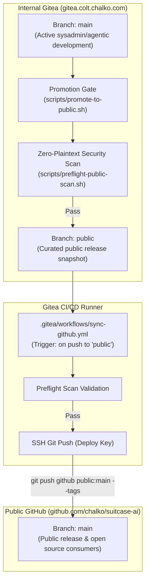

# Suitcase AI Public Release & GitHub Mirroring Runbook

This runbook outlines the operational lifecycle, security boundaries, and step-by-step procedures for synchronizing the sovereign **Suitcase AI** codebase from internal Gitea infrastructure (`colt/suitcase-ai`) to the public GitHub repository ([`github.com/chalko/suitcase-ai`](https://github.com/chalko/suitcase-ai)).

---

## 1. Branch Topology & Architecture



| Branch / Remote            | Purpose                                                            | Access Control                                    |
| :------------------------- | :----------------------------------------------------------------- | :------------------------------------------------ |
| **`colt/main`** (Gitea)    | Internal development, agent automation, ongoing feature branches.  | Internal agents & sysadmins only.                 |
| **`colt/public`** (Gitea)  | Gatekeeper branch containing sanitized, validated release commits. | Protected; updated only via promotion script.     |
| **`github/main`** (GitHub) | Public mirror of `colt/public` for open-source consumers.          | Public read-only; pushed automatically via CI/CD. |

---

## 2. Gitea Actions Secret Configuration

The automated push workflow requires an SSH deploy key with write permissions to the GitHub repository:

1. **Generate SSH Key Pair:**

   ```bash
   ssh-keygen -t ed25519 -C "gitea-sync@suitcase-ai.colt.chalko.com" -f ~/.ssh/suitcase_ai_github_deploy -N ""
   ```

2. **Add Public Key to GitHub:**
   - Navigate to [`https://github.com/chalko/suitcase-ai/settings/keys`](https://github.com/chalko/suitcase-ai/settings/keys).
   - Click **Add deploy key**.
   - Title: `Gitea Public Branch Sync (colt)`.
   - Key: Paste contents of `suitcase_ai_github_deploy.pub`.
   - Check **Allow write access**.
3. **Add Private Key to Gitea Secrets:**
   - Navigate to `https://gitea.colt.chalko.com/colt/suitcase-ai/settings/actions/secrets`.
   - Add Secret Name: **`GITHUB_DEPLOY_KEY`**.
   - Secret Value: Paste entire private key content (`suitcase_ai_github_deploy`).

---

## 3. Routine Release Promotion Procedure

To promote the current state of `main` to the public GitHub repository:

1. **Verify Local Working Tree:**

   ```bash
   git status
   ```

   Ensure all intended changes are committed.

2. **Execute Promotion Script:**

   ```bash
   ./scripts/promote-to-public.sh
   ```

   This script performs the following automated steps:

   - Runs `./scripts/preflight-public-scan.sh` to ensure Zero-Plaintext compliance (no private keys, API tokens, root Vault keys, or internal domain leaks).
   - Fast-forwards the local `public` branch to match `main` HEAD.
   - Pushes `public` to Gitea remote (`colt/public`).
   - Switches back to `main`.

3. **Verify Gitea Action Pipeline:**

   - Check the Actions tab in Gitea: `https://gitea.colt.chalko.com/colt/suitcase-ai/actions`.
   - Confirm the `Sync Public Branch to GitHub` workflow succeeds and pushes to GitHub.

4. **Verify GitHub Repository:**
   - Confirm the latest commit matches at [`https://github.com/chalko/suitcase-ai/commits/main`](https://github.com/chalko/suitcase-ai/commits/main).

---

## 4. Emergency Remediation & Rollback

If a commit on `public` needs to be reverted or amended:

1. **Reset `public` to a previous known-good commit:**

   ```bash
   git checkout public
   git reset --hard <GOOD_COMMIT_SHA>
   git push --force colt public
   ```

2. **Preflight Scan Failure:**
   If `./scripts/preflight-public-scan.sh` fails:
   - Identify the leaked secret or forbidden string reported in the output.
   - Remove or sanitize the occurrence on `main`.
   - Commit the sanitization fix, then rerun `./scripts/promote-to-public.sh`.
