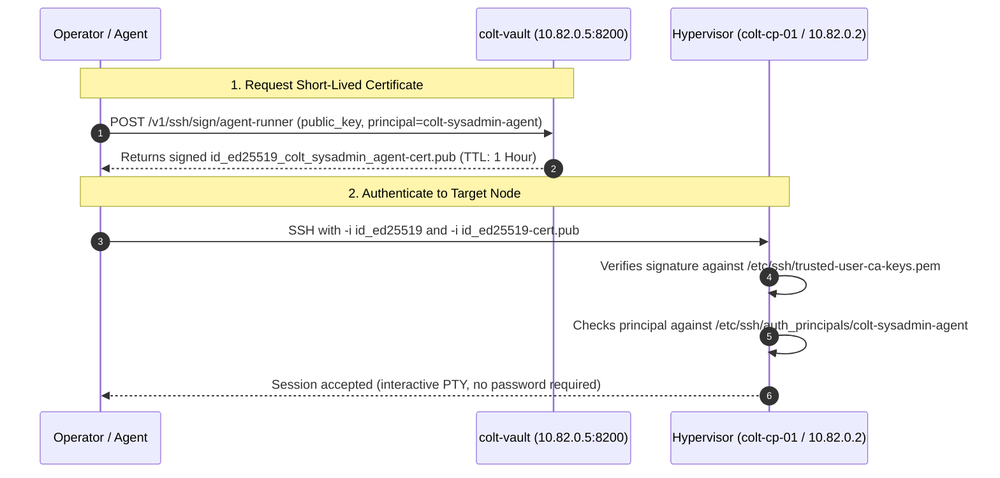

# Camp Colt Zero-Secret & Security Architecture

This document describes the security model, Non-Human Identity (NHI) governance, and OpenSSH Certificate Authority architecture deployed across **Camp Colt** (Suitcase AI).

---

## 🔒 Security Principles

1. **Zero Standing Secrets:** Agents, automation playbooks, and operators never store or commit static SSH private keys or root credentials to git.
2. **Short-Lived Ephemeral Identity:** Access to bare-metal hypervisors is governed strictly by OpenSSH client certificates with a 1-hour time-to-live (TTL).
3. **Immutable Node OS (Talos Linux):** Virtualized Kubernetes nodes run Talos Linux without interactive shell access, SSH daemons, or package managers.
4. **Least-Privilege Non-Human Identities:** All administrative actions run under dedicated service identities (`colt-sysadmin-agent`) bounded by explicit sudoers rules.

---

## 🏛️ OpenSSH Certificate Authority Architecture

Camp Colt uses an internal **OpenSSH Certificate Authority** running on HashiCorp Vault (`colt-vault` @ `10.82.0.5:8200` / LXC 9190).



---

## ⚙️ Target Host Trust Configuration

Every bare-metal host in Camp Colt (`colt-cp-01`, `colt-gpu-01`) is provisioned using [`scripts/provision_host_colt_sysadmin.sh`](../scripts/provision_host_colt_sysadmin.sh):

### 1. Trusted CA Keys (`/etc/ssh/trusted-user-ca-keys.pem`)

Contains the public key of the Certificate Authority:

```text
ssh-rsa AAAAB3NzaC1yc2E... colt-vault-ssh-ca
```

Configured in `/etc/ssh/sshd_config`:

```text
TrustedUserCAKeys /etc/ssh/trusted-user-ca-keys.pem
AuthorizedPrincipalsFile /etc/ssh/auth_principals/%u
```

### 2. Authorized Principals (`/etc/ssh/auth_principals/colt-sysadmin-agent`)

Restricts allowed certificate principals:

```text
colt-sysadmin-agent
colt-sysadmin
```

### 3. Sudoers Rule (`/etc/sudoers.d/99-colt-sysadmin-agent`)

Grants scoped, auditable administrative execution to the service identity:

```text
colt-sysadmin-agent ALL=(ALL) NOPASSWD: ALL
```

---

## 🛠️ Minting & Using Ephemeral Certificates

### Automatic Issuance via Vault (`scripts/sign_agent_cert.sh`)

To generate a 1-hour signed certificate for host administration:

```bash
# Load environment credentials
source scripts/load_colt_env.sh

# Mint certificate for local key
./scripts/sign_agent_cert.sh ~/.ssh/id_ed25519

# Connect to hypervisor
./scripts/ssh_colt_cp.sh
```

### Inspecting Certificate Details

To verify certificate validity, principal, and constraints:

```bash
ssh-keygen -L -f agent-keys/agents/colt-sysadmin/id_ed25519_colt_sysadmin_agent-cert.pub
```

Example output:

```text
Type: ssh-ed25519-cert-v01@openssh.com user certificate
Public key: ED25519-CERT SHA256:...
Signing CA: RSA SHA256:...
Key ID: "colt-sysadmin-agent"
Valid: from 2026-09-05T10:00:00 to 2026-09-05T11:00:00
Principals:
        colt-sysadmin-agent
Critical Options: (none)
Extensions:
        permit-pty
        permit-user-rc
```
