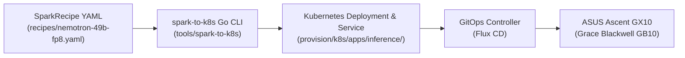

# Spark Arena Recipe & Benchmark Specification for ASUS Ascent GX10

This document defines the declarative architecture, compiler lifecycle, storage tiering doctrine, and automated benchmarking procedures for running frontier LLM inference engines on the **ASUS Ascent GX10 (NVIDIA Grace Blackwell GB10)** sovereign appliance at Camp Colt.

---

## 1. Declarative Recipe Architecture (`SparkRecipe`)

The **`SparkRecipe`** specification (`apiVersion: inference.colt.ai/v1alpha1`, `kind: SparkRecipe`) decouples high-level model declarations and hardware constraints from low-level Kubernetes plumbing.



### Core Schema Fields

| Field                                   | Type     | Description                                                                   |
| :-------------------------------------- | :------- | :---------------------------------------------------------------------------- |
| **`spec.model.name`**                   | `string` | Canonical model identifier (e.g. `nvidia/llama-3.3-nemotron-super-49b-v1.5`). |
| **`spec.model.format`**                 | `string` | Quantization format (`fp8`, `nvfp4`, `bfloat16`, `awq`).                      |
| **`spec.model.contextLength`**          | `int`    | Maximum supported sequence length (e.g. `32768`).                             |
| **`spec.runtime.engine`**               | `string` | Inference engine runtime (`nim` or `vllm`).                                   |
| **`spec.runtime.image`**                | `string` | Container image repository and tag.                                           |
| **`spec.runtime.gpuMemoryUtilization`** | `float`  | Clamped GPU memory utilization (max `0.75` on GB10 UMA).                      |
| **`spec.hardware.accelerator`**         | `string` | Target hardware platform (`gb10`).                                            |
| **`spec.hardware.architecture`**        | `string` | Target CPU architecture (`arm64`).                                            |
| **`spec.storage.capacityTier`**         | `string` | ModelDepot capacity path (`/mnt/model-depot`).                                |
| **`spec.storage.fastTier`**             | `string` | ReadyLocker NVMe cache path (`/workspace/models/fast-cache`).                 |

---

## 2. Grace Blackwell GB10 Unified Memory (UMA) Guidelines

The ASUS Ascent GX10 features an integrated NVIDIA Grace Blackwell GB10 superchip with 128 GB LPDDR5X Unified Memory shared between 72 Arm Neoverse V2 cores and the Blackwell GPU tensor cores.

> [!IMPORTANT] > **UMA Clamping Constraint:**
>
> - The GPU memory utilization (`gpuMemoryUtilization` / `NIM_GPU_MEMORY_UTILIZATION`) MUST be clamped to a maximum of **`0.75`** ($\le 96\text{ GB}$).
> - This reserves a mandatory minimum of **32 GB** of system RAM for the Linux kernel, Talos host services, and K8s networking buffers.
> - Exceeding 0.75 triggers Linux Out-Of-Memory (OOM) killer terminations across host processes.

---

## 3. The 3-Phase ModelDepot Lifecycle

Every compiled inference workload executes a strict 3-phase initialization sequence:

1. **Phase 1A: `depot-hydration-preflight` (Hydration Preflight):**
   - Checks if validated model weights exist in ModelDepot (`/mnt/model-depot/nims/validated/`).
   - Copies missing files to ReadyLocker fast cache (`/workspace/models/fast-cache`).
   - Enforces `0777` permissions so unprivileged engine processes (UID 1000) can access weights.
2. **Phase 1B: `download-model` / Validation:**
   - Validates model profiles and verifies cryptographic hashes against NVIDIA NGC or HuggingFace hubs.
3. **Phase 1C: `cache-flusher` (UMA Memory Reclamation):**
   - Runs a privileged busybox step: `sync && echo 3 > /proc/sys/vm/drop_caches`.
   - Reclaims host page cache consumed during file transfers before the engine allocates GPU tensors.
4. **Phase 2: Runtime Engine:**
   - Launches the inference server on decoupled ports: `:8000` (OpenAI HTTP API) and `:8002` (Health & Readiness Probes).

---

## 4. `spark-to-k8s` Compiler Tooling

The type-safe compiler is implemented in Go under [`tools/spark-to-k8s/`](file:///home/luna-mayor-agent/luna/rigs/suitcase-ai/tools/spark-to-k8s/) using Go `text/template` rendering.

### Usage Commands

```bash
# Compile a recipe to Kubernetes manifest
spark-to-k8s --input provision/k8s/apps/inference/recipes/nemotron-49b-fp8.yaml \
             --output provision/k8s/apps/inference/nemotron-49b.yaml

# Validate recipe without rendering
spark-to-k8s --input provision/k8s/apps/inference/recipes/north-mini-code-nvfp4.yaml --validate

# Run compiler unit tests
go test -v ./tools/spark-to-k8s/...
```

---

## 5. In-Cluster Benchmarking with `llama-benchy`

To benchmark latency, time-to-first-token (TTFT), and tokens-per-second (TPS) on live inference pods:

```bash
# Submit benchmark job
kubectl apply -f provision/k8s/apps/inference/benchmarks/llama-benchy-job.yaml

# Follow benchmark logs
kubectl logs -n nim-system job/llama-benchy-nemotron-49b -f

# Verify generated metrics
kubectl exec -n nim-system $(kubectl get pods -n nim-system -l app=llama-benchy -o jsonpath='{.items[0].metadata.name}') -- cat /tmp/results.csv
```
