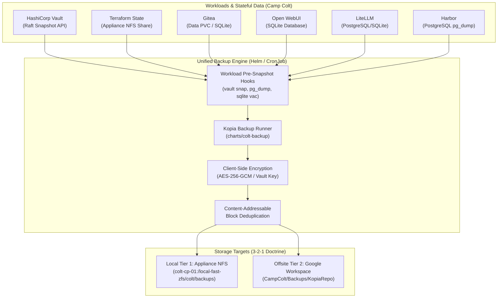

# Consolidated Appliance 3-2-1 Backup Architecture (Kopia & Declarative Retention)

> **For agentic workers:** REQUIRED SUB-SKILL: Use `superpowers:subagent-driven-development` (recommended) or `superpowers:executing-plans` to implement this plan task-by-task. Steps use checkbox (`- [ ]`) syntax for tracking.

**Goal:** Consolidate Camp Colt's fragmented per-service backup scripts into a unified, deduplicated, client-side encrypted 3-2-1 backup framework using **Kopia** and policy-based GFS retention (`rotate-backups`/Kopia policy), packaged as a reusable Helm chart / GitOps module for Kubernetes.

**Architecture:** A unified backup framework where a standardized container image (Kopia + database snapshot utilities) connects to a centralized, content-addressable, client-side encrypted Kopia repository on Google Drive (with local appliance NFS cache/mirror). Each stateful workload (Vault Raft, Terraform state, Gitea, Open WebUI, LiteLLM, Harbor DB) is declared as a target instance with automated pre-hooks (e.g., `pg_dump`, `vault snapshot`, `sqlite3 .backup`) feeding into deduplicated Kopia snapshots with strict 14D/6W/13M/1Y retention.

**Tech Stack:**

- **Backup Engine:** Kopia (`kopia/kopia:0.18.2` or Alpine-based Kopia CLI)
- **Encryption:** Client-side AES-256-GCM / ChaCha20-Poly1305 with repository password in Vault
- **Deduplication:** Content-addressable chunk hashing (BLAKE2s/BLAKE3)
- **Retention:** Kopia Snapshot Policies & `rotate-backups` (14 Daily, 6 Weekly, 13 Monthly, 1 Yearly)
- **Packaging:** Reusable Helm Chart (`charts/colt-backup`) & Flux GitOps Kustomize module

**Spec / Tracking Bead:** `sa-pxh` ("Consolidate Appliance Backups using Kopia, Policy-Based Retention, and Unified Helm/GitOps Architecture")

---

## Global Constraints

- **Zero-Secret / Least Privilege:** Master Kopia repository passwords and Google Drive Service Account credentials must be loaded exclusively from HashiCorp Vault (`secret/colt/backup/*`); never print or commit plaintext tokens.
- **Air-Gapped Resiliency:** The backup framework must support local appliance storage (NFS on `colt-cp-01`) as a primary or cached repository when operating offline without internet connectivity.
- **Image Pinning:** Never use `:latest` image tags. All containers must specify immutable versions (`kopia:0.18.2`, `rclone:1.68.2`, `vault:1.18.4`, etc.).
- **Rig Isolation:** Execute strictly within the Camp Colt environment (`10.82.0.0/16`, `colt-kubeconfig`).

---

## Architecture Diagram

---

## Implementation Tasks

### Task 1: Initialize Kopia Vault Secrets & Repository Configuration

**Files:**

- Create: `provision/k8s/apps/backup-system/kopia-secret-generator.sh`
- Modify: `provision/colt_vault_policies.tf`

**Interfaces:**

- Consumes: HashiCorp Vault KV v2 engine (`secret/colt/backup/*`).
- Produces: Kopia repository encryption password and GCP Service Account binding.

- [ ] **Step 1: Define Kopia Vault Policy & Secret Structure**
      Create secret entry `secret/colt/backup/kopia` containing `repository_password` (256-bit high-entropy passphrase) and `gdrive_folder_id`.
- [ ] **Step 2: Update Terraform Vault Policy**
      Add read access for `secret/data/colt/backup/kopia` to the `vault-backup` policy in `provision/colt_vault_policies.tf`.
- [ ] **Step 3: Commit and Apply via Terraform**
      Apply policy updates using `terraform apply`.

---

### Task 2: Develop Reusable Helm Chart (`charts/colt-backup`)

**Files:**

- Create: `provision/k8s/charts/colt-backup/Chart.yaml`
- Create: `provision/k8s/charts/colt-backup/values.yaml`
- Create: `provision/k8s/charts/colt-backup/templates/cronjob.yaml`
- Create: `provision/k8s/charts/colt-backup/templates/configmap.yaml`
- Create: `provision/k8s/charts/colt-backup/templates/rbac.yaml`

**Interfaces:**

- Consumes: Workload parameters (type: `vault`, `gitea`, `sqlite`, `postgres`, `fs`), schedule, PVC mounts.
- Produces: Reusable CronJobs executing pre-hooks, Kopia snapshots, and GFS retention enforcement.

- [ ] **Step 1: Author `Chart.yaml` and default `values.yaml`**
      Define configurable parameters for repository backends (Google Drive via rclone/gcs backend and local filesystem/NFS), retention policy (14 daily, 6 weekly, 13 monthly, 1 yearly), and hook definitions.
- [ ] **Step 2: Create Modular Pre-Hook Scripts in ConfigMap**
  - Hook `vault-raft`: Authenticates via K8s auth and streams `vault operator raft snapshot save`.
  - Hook `sqlite`: Executes `.backup` or `VACUUM INTO` on live SQLite files (`open-webui`, `litellm`).
  - Hook `postgres`: Executes `pg_dump` streaming into Kopia.
  - Hook `fs`: Directly snapshots mounted volumes (e.g. NFS tfstate).
- [ ] **Step 3: Create CronJob Template**
      Embeds Kopia CLI (`kopia snapshot create`, `kopia snapshot gc`, `kopia policy set --keep-daily=14 --keep-weekly=6 --keep-monthly=13 --keep-annual=1`).
- [ ] **Step 4: Lint and Validate Helm Chart**
      Run `helm lint provision/k8s/charts/colt-backup` and `helm template` tests.

---

### Task 3: Deploy Consolidated Backup Instances via GitOps

**Files:**

- Create: `provision/k8s/apps/backup-system/namespace.yaml`
- Create: `provision/k8s/apps/backup-system/release-vault.yaml`
- Create: `provision/k8s/apps/backup-system/release-tfstate.yaml`
- Create: `provision/k8s/apps/backup-system/release-gitea.yaml`
- Create: `provision/k8s/apps/backup-system/release-openwebui.yaml`
- Create: `provision/k8s/apps/backup-system/release-litellm.yaml`
- Create: `provision/k8s/apps/backup-system/release-harbor.yaml`
- Create: `provision/k8s/apps/backup-system/kustomization.yaml`
- Modify: `provision/k8s/kustomization.yaml`

- [ ] **Step 1: Deploy `backup-system` namespace and shared Kopia repository secret**
- [ ] **Step 2: Instantiate HelmRelease for HashiCorp Vault and Terraform state**
- [ ] **Step 3: Instantiate HelmRelease for Open WebUI and LiteLLM**
- [ ] **Step 4: Instantiate HelmRelease for Gitea and Harbor PostgreSQL**
- [ ] **Step 5: Reconcile with Flux GitOps (`flux reconcile kustomization camp-colt-infra`)**

---

### Task 4: Live Snapshot, Deduplication & Disaster Recovery Drill

**Files:**

- Create: `docs/DISASTER_RECOVERY_KOPIA.md`

- [ ] **Step 1: Trigger Manual Snapshot Jobs for All Workloads**
      Execute manual test runs for each declared backup job.
- [ ] **Step 2: Verify Kopia Deduplication & Encryption on Google Drive**
      Verify content chunks, metadata manifests, and retention pruning on Google Drive.
- [ ] **Step 3: Execute Disaster Recovery Restore Test**
      Mount Kopia repository in an isolated drill container and restore:
  1. Vault Raft snapshot (verify unseal integrity).
  2. Terraform state (verify GPG signature and JSON structure).
  3. Open WebUI SQLite DB (verify table integrity).
- [ ] **Step 4: Dispatch Mandatory Live Inference Prompt**
      Verify GB10 health: `curl -s http://10.82.0.3:8000/v1/chat/completions`.
- [ ] **Step 5: Close Tracking Bead `sa-pxh`**

---

## Execution Handoff

Plan complete and saved to `docs/superpowers/plans/2026-09-10-consolidated-kopia-backup-architecture.md`.

**Two execution options:**

1. **Subagent-Driven (recommended)** — I dispatch a fresh subagent per task, review between tasks, with fast iterative progress.
2. **Inline Execution** — Execute tasks sequentially in this session with review checkpoints.

**Which approach would you prefer?**
