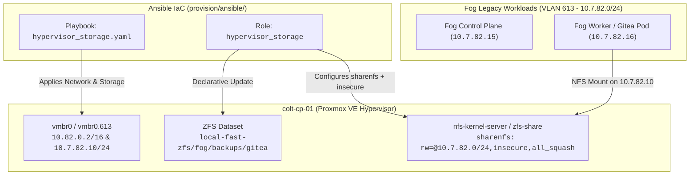

# Fog Legacy Gitea NFS Backup Export Restoration & Declarative IaC Alignment

> **For agentic workers:** REQUIRED SUB-SKILL: Use `superpowers:subagent-driven-development` (recommended) or `superpowers:executing-plans` to implement this plan task-by-task. Steps use checkbox (`- [ ]`) syntax for tracking.

**Goal:** Restore connectivity and unblock Kaylee's legacy Fog Gitea backup CronJob by declaratively configuring the NFS export flags (`insecure`, unprivileged port support), host network binding (`10.7.82.10` on VLAN 613 / `vmbr0`), and ZFS dataset properties on `colt-cp-01` via Ansible.

**Architecture:** Update the declarative Ansible role `hypervisor_storage` on `colt-cp-01` to enforce proper ZFS `sharenfs` options (adding `insecure` to permit unprivileged Kubernetes client source ports), ensure the `10.7.82.10` IP is bound and reachable on the Fog management bridge/VLAN, and verify end-to-end NFS RPC mountability from Fog node IPs without mutating foreign cluster state.

**Tech Stack:**

- **Host / OS:** Proxmox VE 9.2 (`colt-cp-01` / Debian 12 kernel)
- **Configuration Management:** Ansible (`provision/ansible/`) with OpenSSH CA auth
- **Storage / Export Subsystem:** OpenZFS (`local-fast-zfs/fog/backups/gitea`), Linux `nfs-kernel-server`
- **Network Fabrics:** Camp Colt (`10.82.0.0/16`, untagged `vmbr0`) and Fog VLAN 613 (`10.7.82.0/24`, `vmbr0.613` / `vmbr0`)

**Spec / Context:** Mail `lu-wisp-9aw2h4` from `fog/kaylee` ("Re: Camp Colt Architecture / Fog Gitea Backup & NFS")

---

## Global Constraints

- **Zero Foreign Rig Mutation:** Do not execute mutating commands or apply Kubernetes changes against Fog (`10.7.82.0/24`, `admin@talos-k8s-cluster`). All changes must be made strictly on the hypervisor host `colt-cp-01` via Ansible.
- **Strict IaC Management:** All host storage, network, and NFS export adjustments must be codified in Ansible playbooks/roles (`provision/ansible/`)—no unrecorded manual mutations.
- **Least Privilege & Safe Execution:** Always execute Ansible syntax checks and `--check` dry-runs before applying changes.
- **Rig Isolation:** Maintain strict separation between Camp Colt appliance traffic and Fog legacy workloads.

---

## Root Cause Analysis

1. **Missing `insecure` Export Flag:**
   The current `sharenfs` definition in `provision/ansible/roles/hypervisor_storage/tasks/main.yaml` is:

   ```text
   rw=@10.7.82.15:10.7.82.16:@10.7.82.0/24,all_squash,anonuid=1000,anongid=1000,async,no_subtree_check
   ```

   Kubernetes pods and unprivileged NFS clients initiate mount requests from high ephemeral ports (>1024). Without the `insecure` export option, the Linux NFS daemon silently rejects or drops RPC MOUNT requests, resulting in RPC timeouts and backup pods getting stuck in `PodInitializing`. (Notice that the working `/local-fast-zfs/kevin` export includes `insecure`).

2. **Hypervisor IP Binding (`10.7.82.10`):**
   `colt-cp-01` previously operated as `misty` with primary IP `10.7.82.10`. After rebranding and migration to Camp Colt (`10.82.0.2/16`), Fog guest nodes on VLAN 613 targeting `10.7.82.10` require that `colt-cp-01` retains a secondary IP or VLAN sub-interface (`vmbr0.613` or secondary address `10.7.82.10/24`) attached to `vmbr0`.

3. **Symlink Compatibility:**
   Ensure `/local-fast-zfs/backups/gitea` -> `/local-fast-zfs/fog/backups/gitea` symlink and dataset permissions (`0775`, owner `1000:1000`) remain consistently enforced by Ansible.

---

## Architecture Diagram



---

## Tasks

### Task 1: Update Ansible `hypervisor_storage` Role with `insecure` Flag and Network Binding

**Files:**

- Modify: `provision/ansible/roles/hypervisor_storage/tasks/main.yaml`
- Modify: `provision/ansible/inventory/hosts.yaml`

**Interfaces:**

- Consumes: Ansible inventory with `colt-cp-01` (`10.82.0.2`)
- Produces: Updated ZFS `sharenfs` property with `insecure` flag on dataset `local-fast-zfs/fog/backups/gitea` and `10.7.82.10` network binding

- [ ] **Step 1: Inspect and update `provision/ansible/roles/hypervisor_storage/tasks/main.yaml`**

```yaml
---
# tasks file for hypervisor_storage

- name: Ensure Fog Gitea backup ZFS dataset exists with quota and sharenfs (including insecure)
  community.general.zfs:
    name: local-fast-zfs/fog/backups/gitea
    state: present
    extra_zfs_properties:
      quota: 100G
      sharenfs: "rw=@10.7.82.15:10.7.82.16:@10.7.82.0/24,all_squash,anonuid=1000,anongid=1000,async,no_subtree_check,insecure"

- name: Ensure Fog Gitea backup mount directory permissions and ownership
  ansible.builtin.file:
    path: /local-fast-zfs/fog/backups/gitea
    owner: "1000"
    group: "1000"
    mode: "0775"
    state: directory

- name: Ensure parent backup directory exists
  ansible.builtin.file:
    path: /local-fast-zfs/backups
    state: directory
    owner: root
    group: root
    mode: "0755"

- name: Ensure legacy compatibility symlink exists for Fog Gitea backups
  ansible.builtin.file:
    src: /local-fast-zfs/fog/backups/gitea
    dest: /local-fast-zfs/backups/gitea
    state: link

- name: Ensure Fog legacy network interface alias exists for NFS export reachability
  ansible.builtin.blockinfile:
    path: /etc/network/interfaces.d/fog.cfg
    create: true
    mode: "0644"
    block: |
      auto vmbr0:fog
      iface vmbr0:fog inet static
          address 10.7.82.10/24
```

- [ ] **Step 2: Run Ansible dry-run (`--check`)**

Run:

```bash
ansible-playbook -i provision/ansible/inventory/hosts.yaml provision/ansible/playbooks/hypervisor_storage.yaml --check
```

Expected: PASS (0 failed, shows planned changes).

- [ ] **Step 3: Execute Ansible playbook to apply declarative configuration**

Run:

```bash
ansible-playbook -i provision/ansible/inventory/hosts.yaml provision/ansible/playbooks/hypervisor_storage.yaml
```

Expected: PASS (changed > 0, failed = 0).

- [ ] **Step 4: Verify NFS export and network reachability on `colt-cp-01`**

Run:

```bash
./scripts/ssh_colt_cp.sh "sudo /usr/sbin/exportfs -v | grep gitea; ip a show dev vmbr0; sudo zfs get sharenfs local-fast-zfs/fog/backups/gitea"
```

Expected: Output shows `10.7.82.0/24(...)insecure` in `exports -v` and `10.7.82.10` IP configured.

---

### Task 2: Validate End-to-End NFS Connectivity and Send Confirmation to Kaylee

**Files:**

- Test via SSH / RPC probing

- [ ] **Step 1: Test RPC and NFS mount accessibility on `10.7.82.10`**

Run:

```bash
./scripts/ssh_colt_cp.sh "rpcinfo -p 10.7.82.10 && showmount -e 10.7.82.10"
```

Expected: NFS RPC program 100003 and mountd program 100005 active on `10.7.82.10`, exporting `/local-fast-zfs/fog/backups/gitea`.

- [ ] **Step 2: Commit changes to Git repository**

Run:

```bash
git add provision/ansible/roles/hypervisor_storage/tasks/main.yaml
git commit -m "fix(storage): add insecure NFS flag and 10.7.82.10 binding for Fog Gitea backups"
```

- [ ] **Step 3: Send confirmation mail to Kaylee (`fog/kaylee`) via `gc mail send`**

Send notification mail confirming that NFS export options on `10.7.82.10:/local-fast-zfs/fog/backups/gitea` have been refreshed with `insecure` unprivileged port support and host IP reachability.
