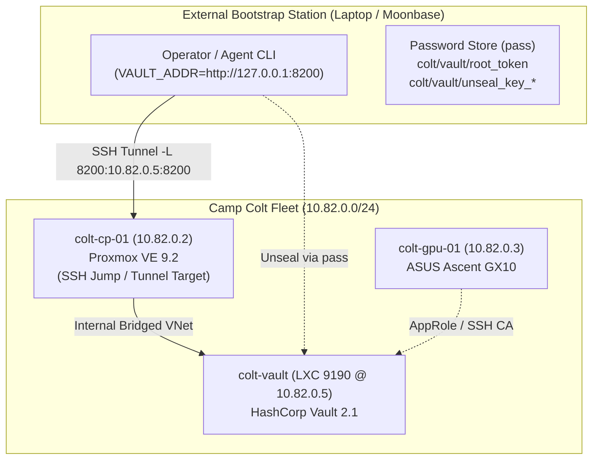

# Camp Colt Vault Bootstrap & Configuration Implementation Plan

> **For agentic workers:** REQUIRED SUB-SKILL: Use
> superpowers:subagent-driven-development (recommended) or
> superpowers:executing-plans to implement this plan task-by-task. Steps use
> checkbox (`- [ ]`) syntax for tracking.

**Goal:** Deploy, initialize, and configure a sovereign, zero-plaintext
HashCorp Vault instance (`colt-vault` @ `10.82.0.5`) on Proxmox VE
(`colt-cp-01`), matching the production architecture, `pass` credential storage,
and RBAC policy model of `vault.fog`.

**Architecture:** HashCorp Vault 2.1 deployed inside dedicated Proxmox LXC
Container 9190 (`colt-vault` on `10.82.0.0/24`), bootstrapped and operated from
outside the network via SSH tunnel / `pct exec` over `colt-cp-01` (`10.82.0.2`),
using file-backed persistent storage (`/opt/vault/data`), password-store
(`pass`) unseal management, KV-v2 secrets engine (`secret/`), OpenSSH CA signing
engine (`ssh/`), and multi-auth backends (TLS Cert mTLS, AppRole, and Talos
Kubernetes Auth).

**Tech Stack:** Proxmox VE 9.2, HashCorp Vault 2.1.0, Debian 12 Bookworm,
OpenSSH CA Engine, Password-Store (`pass` / GPG), Systemd, Python 3 / Bash
automation.

**Spec:**
`/home/luna-mayor-agent/luna/rigs/scai/plans/0.1/ssh_vault_phase_0_1.md` and
`/home/luna-mayor-agent/luna/rigs/fog/provision/vault_config.tf`

## Global Constraints

- Target Infrastructure: `colt-cp-01` (`10.82.0.2`), hosting `colt-vault` (LXC
  9190 @ `10.82.0.5`)
- External Bootstrap Accessibility: Bootstrapped and managed from outside the
  isolated `10.82.0.0/24` network via SSH port-forwarding tunnel
  (`ssh -L 8200:10.82.0.5:8200 colt-sysadmin-agent@10.82.0.2`) or
  `pct exec 9190`
- Storage Backend: `/opt/vault/data` (persistent, mode `0700`, owner
  `vault:vault`)
- Security & Secrets Management: Master unseal keys and root tokens stored
  strictly in `pass` (`colt/vault/*` or `scai/vault/*`). Zero plaintext secrets
  committed to git
- SSH CA Role Lockdown: `ssh/roles/agent-runner` restricted strictly to
  `colt-sysadmin-agent` as allowed user
- Operational Compatibility: Mirror `vault.fog` RBAC policies (`colt-owner`,
  `colt-ro`), AppRole, TLS Cert auth, and `unseal-vault.sh` `pass` workflow

---



---

### Task 1: Proxmox LXC Configuration & External Tunnel Scaffolding

**Files:**

- Create: `/etc/vault.d/vault.hcl` (on `colt-vault` CT 9190)
- Create: `/opt/vault/data` (on `colt-vault` CT 9190)
- Create: `bin/vault-tunnel.sh` (mode `0755`)

**Interfaces:**

- Consumes: SSH CA access to `colt-cp-01` (`10.82.0.2`)
- Produces: Hardened systemd service on CT 9190 and local SSH tunnel endpoint
  (`127.0.0.1:8200`)

- [ ] **Step 1: Write declarative `vault.hcl` template**

```hcl
ui = true
disable_mlock = true

storage "file" {
  path = "/opt/vault/data"
}

listener "tcp" {
  address     = "0.0.0.0:8200"
  tls_disable = 1
}

api_addr = "http://10.82.0.5:8200"
cluster_addr = "http://10.82.0.5:8201"
```

- [ ] **Step 2: Deploy configuration to CT 9190 and start service**

```bash
ssh -i ~/.ssh/agents/id_ed25519_colt_sysadmin_agent -i ~/.ssh/agents/id_ed25519_colt_sysadmin_agent-cert.pub colt-sysadmin-agent@10.82.0.2 "sudo /usr/sbin/pct exec 9190 -- bash -c '
mkdir -p /opt/vault/data /etc/vault.d
chown -R vault:vault /opt/vault /etc/vault.d
chmod 700 /opt/vault/data
systemctl enable --now vault
systemctl is-active vault
'"
```

Expected output: `active`

- [ ] **Step 3: Create helper script `bin/vault-tunnel.sh` for external
      connectivity**

```bash
cat << 'EOF' > bin/vault-tunnel.sh
#!/usr/bin/env bash
set -euo pipefail

echo "[*] Establishing background SSH tunnel to colt-vault (10.82.0.5:8200) via colt-cp-01..."
ssh -f -N -o StrictHostKeyChecking=accept-new \
    -i ~/.ssh/agents/id_ed25519_colt_sysadmin_agent \
    -i ~/.ssh/agents/id_ed25519_colt_sysadmin_agent-cert.pub \
    -L 8200:10.82.0.5:8200 \
    colt-sysadmin-agent@10.82.0.2

export VAULT_ADDR="http://127.0.0.1:8200"
echo "[✓] Tunnel established. Local endpoint: http://127.0.0.1:8200"
vault status
EOF
chmod +x bin/vault-tunnel.sh
```

---

### Task 2: Master Vault Initialization & `pass` Secrets Storage

**Files:**

- Create: `bin/unseal-vault.sh` (mode `0755`)
- Register in `pass`: `colt/vault/root_token`, `colt/vault/unseal_key_1` (or
  1..3)

**Interfaces:**

- Consumes: Running uninitialized Vault reachable at `http://127.0.0.1:8200` via
  tunnel
- Produces: Initialized Vault instance with master credentials stored in
  operator's `pass` store

- [ ] **Step 1: Execute initialization and store directly into `pass`**

```bash
INIT_OUT=$(ssh -i ~/.ssh/agents/id_ed25519_colt_sysadmin_agent -i ~/.ssh/agents/id_ed25519_colt_sysadmin_agent-cert.pub colt-sysadmin-agent@10.82.0.2 "sudo /usr/sbin/pct exec 9190 -- env VAULT_ADDR=http://127.0.0.1:8200 vault operator init -format=json -key-shares=3 -key-threshold=2")

ROOT_TOKEN=$(echo "${INIT_OUT}" | jq -r .root_token)
KEY1=$(echo "${INIT_OUT}" | jq -r '.unseal_keys_b64[0]')
KEY2=$(echo "${INIT_OUT}" | jq -r '.unseal_keys_b64[1]')
KEY3=$(echo "${INIT_OUT}" | jq -r '.unseal_keys_b64[2]')

echo "${ROOT_TOKEN}" | pass insert -m colt/vault/root_token
echo "${KEY1}" | pass insert -m colt/vault/unseal_key_1
echo "${KEY2}" | pass insert -m colt/vault/unseal_key_2
echo "${KEY3}" | pass insert -m colt/vault/unseal_key_3
```

- [ ] **Step 2: Create automated unseal script (`bin/unseal-vault.sh`) matching
      `vault.fog`**

```bash
cat << 'EOF' > bin/unseal-vault.sh
#!/usr/bin/env bash
set -euo pipefail

VAULT_ADDR="${VAULT_ADDR:-http://127.0.0.1:8200}"
export VAULT_ADDR

echo "=========================================================="
echo "Unsealing Camp Colt HashCorp Vault (${VAULT_ADDR})"
echo "Retrieving unseal keys from password-store (pass)..."
echo "=========================================================="

KEY1=$(pass show colt/vault/unseal_key_1 2>/dev/null || pass show scai/vault/unseal_key_1)
KEY2=$(pass show colt/vault/unseal_key_2 2>/dev/null || pass show scai/vault/unseal_key_2)

vault operator unseal "$KEY1"
vault operator unseal "$KEY2"

echo "[✓] Colt Vault unseal sequence complete."
EOF
chmod +x bin/unseal-vault.sh
```

- [ ] **Step 3: Run unseal script and verify unsealed state**

```bash
./bin/unseal-vault.sh
vault status
```

Expected output: `Initialized: true`, `Sealed: false`

---

### Task 3: Secrets Engines & Scoped Policies (Matching `vault.fog`)

**Files:**

- Create: `provision/vault_policies/colt_owner.hcl`
- Create: `provision/vault_policies/colt_ro.hcl`
- Create: `provision/vault_policies/colt_agent_ssh.hcl`

**Interfaces:**

- Consumes: Vault root token from `pass show colt/vault/root_token`
- Produces: Enabled `secret/` (KV-v2) and `ssh/` (SSH CA) engines, configured
  RBAC policies

- [ ] **Step 1: Define `colt-owner` and `colt-ro` ACL policies**

`provision/vault_policies/colt_owner.hcl`:

```hcl
path "secret/data/scai/*" {
  capabilities = ["create", "read", "update", "delete", "list"]
}
path "secret/metadata/scai/*" {
  capabilities = ["create", "read", "update", "delete", "list"]
}
path "secret/data/app/*" {
  capabilities = ["create", "read", "update", "delete", "list"]
}
path "secret/metadata/app/*" {
  capabilities = ["create", "read", "update", "delete", "list"]
}
path "secret/data/infrastructure/*" {
  capabilities = ["create", "read", "update", "delete", "list"]
}
path "secret/metadata/infrastructure/*" {
  capabilities = ["create", "read", "update", "delete", "list"]
}
```

`provision/vault_policies/colt_ro.hcl`:

```hcl
path "secret/data/scai/*" {
  capabilities = ["read", "list"]
}
path "secret/metadata/scai/*" {
  capabilities = ["read", "list"]
}
path "secret/data/app/*" {
  capabilities = ["read", "list"]
}
path "secret/metadata/app/*" {
  capabilities = ["read", "list"]
}
path "secret/data/infrastructure/*" {
  capabilities = ["read", "list"]
}
path "secret/metadata/infrastructure/*" {
  capabilities = ["read", "list"]
}
```

- [ ] **Step 2: Configure OpenSSH CA and lockdown `agent-runner` role strictly
      to `colt-sysadmin-agent`**

```bash
export VAULT_TOKEN=$(pass show colt/vault/root_token)

vault secrets enable -path=secret kv-v2 || true
vault secrets enable -path=ssh ssh || true
vault write ssh/config/ca generate_signing_key=true || true

vault write ssh/roles/agent-runner \
    key_type=ca \
    allow_user_certificates=true \
    allowed_users="colt-sysadmin-agent" \
    allowed_domains="colt.internal,scai.local,chalko.com" \
    allow_bare_domains=true \
    allowed_extensions="permit-pty,permit-user-rc" \
    default_extensions='{"permit-pty": "", "permit-user-rc": ""}' \
    default_user="colt-sysadmin-agent" \
    ttl="3600" \
    max_ttl="14400"
```

- [ ] **Step 3: Deploy `colt-agent-ssh` signing policy and export public CA
      key**

```bash
vault policy write colt-agent-ssh - << 'PEOF'
path "ssh/sign/agent-runner" {
  capabilities = ["create", "update"]
}
path "ssh/config/ca" {
  capabilities = ["read"]
}
path "secret/data/*" {
  capabilities = ["read", "list"]
}
PEOF

vault read -field=public_key ssh/config/ca > agent-keys/vault/colt_vault_ssh_ca.pub
cat agent-keys/vault/colt_vault_ssh_ca.pub
```

Expected output: OpenSSH RSA CA public key.

---

### Task 4: Auth Backends (AppRole, TLS Cert, and K8s Integration)

**Files:**

- Create: `agent-keys/agents/colt-sysadmin/colt-sysadmin_tls.crt`

**Interfaces:**

- Consumes: Running unsealed Vault
- Produces: Enabled AppRole, TLS Cert, and Kubernetes auth backends

- [ ] **Step 1: Enable AppRole & TLS Cert auth backends**

```bash
vault auth enable approle || true
vault auth enable cert || true
```

- [ ] **Step 2: Configure AppRole for standalone nodes (`colt-gpu-01`)**

```bash
vault write auth/approle/role/colt-gpu \
    token_policies="colt-ro" \
    token_ttl=24h \
    token_max_ttl=72h
```

- [ ] **Step 3: Configure K8s Auth Backend for Talos Cluster (Post-K8s
      Bootstrap)**

```bash
vault auth enable kubernetes || true
vault write auth/kubernetes/config \
    kubernetes_host="https://10.82.20.2:6443" \
    disable_iss_validation=true
```

---

### Task 5: Ephemeral Agent Certificate Minting Validation

**Files:**

- Create: `bin/mint-ssh-cert.sh` (mode `0755`)

**Interfaces:**

- Consumes: Agent public key and Vault SSH signing role
- Produces: 1-hour OpenSSH client certificate for `colt-sysadmin-agent`

- [ ] **Step 1: Write `bin/mint-ssh-cert.sh` matching `vault.fog` client
      script**

```bash
cat << 'EOF' > bin/mint-ssh-cert.sh
#!/usr/bin/env bash
set -euo pipefail

VAULT_ADDR="${VAULT_ADDR:-http://127.0.0.1:8200}"
VAULT_TOKEN="${VAULT_TOKEN:-$(pass show colt/vault/root_token 2>/dev/null || true)}"
KEY_PATH="${1:-${HOME}/.ssh/agents/id_ed25519_colt_sysadmin_agent.pub}"
CERT_OUT="${KEY_PATH%.pub}-cert.pub"

if [[ -z "${VAULT_TOKEN}" ]]; then
    echo "ERROR: VAULT_TOKEN not found or not passed." >&2
    exit 1
fi

echo "[*] Requesting 1-hour ephemeral SSH cert for colt-sysadmin-agent from Vault (${VAULT_ADDR})..."
curl -sS -H "X-Vault-Token: ${VAULT_TOKEN}" \
    -X POST \
    -d "{\"public_key\": \"$(cat "${KEY_PATH}")\", \"valid_principals\": \"colt-sysadmin-agent\"}" \
    "${VAULT_ADDR}/v1/ssh/sign/agent-runner" | jq -r .data.signed_key > "${CERT_OUT}"

chmod 644 "${CERT_OUT}"
echo "[✓] Ephemeral certificate minted successfully:"
ssh-keygen -L -f "${CERT_OUT}" | grep -E "Type|Valid|Principals"
EOF
chmod +x bin/mint-ssh-cert.sh
```

- [ ] **Step 2: Execute test minting and verify validity**

```bash
./bin/mint-ssh-cert.sh agent-keys/agents/colt-sysadmin/id_ed25519_colt_sysadmin_agent.pub
```

Expected output: Valid 1-hour certificate with principal `colt-sysadmin-agent`.

- [ ] **Step 3: Commit plan and scaffolding to git**

```bash
git add plans/colt_vault_bootstrap_plan.md .gitignore
git commit -m "docs: update Camp Colt Vault bootstrap plan with pass integration and external bootstrap tunnel"
```
