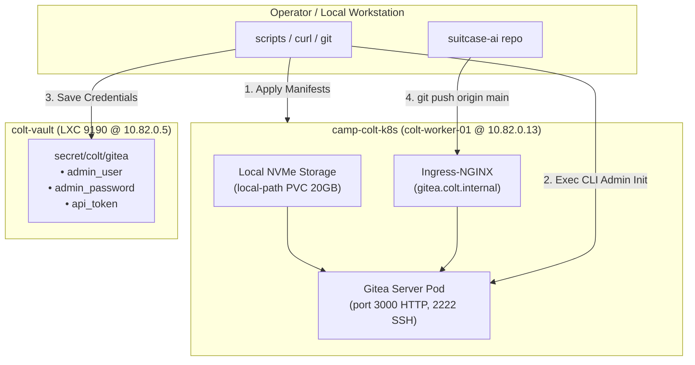

# 🦊 Gitea Deployment, Account Provisioning, & Vault Secret Storage Implementation Plan

> **For agentic workers:** REQUIRED SUB-SKILL: Use
> `superpowers:subagent-driven-development` (recommended) or
> `superpowers:executing-plans` to implement this plan task-by-task. Steps use
> checkbox (`- [ ]`) syntax for tracking.

**Goal:** Deploy a lightweight, resilient Gitea Git forge on `camp-colt-k8s` backed by `local-path` persistent NVMe storage, provision administrative and organization accounts, securely record credentials in `colt-vault` (`10.82.0.5:8200`), and push the local `suitcase-ai` repository as the upstream source of truth for GitOps / Flux.

**Architecture:**

- **Namespace:** `gitea` on `camp-colt-k8s`
- **Node Target:** `colt-worker-01` (`talos-bvf-2i3` @ `10.82.0.13`, x86_64)
- **Database Backend:** SQLite on persistent NVMe volume (lightweight, zero-overhead embedded DB)
- **Storage:** 20GB PersistentVolumeClaim on `local-path` StorageClass (`/data` mount in container)
- **Network Ingress:**
  - HTTP Web / Git Smart HTTP: Port 3000 exposed via Ingress-NGINX (`gitea.colt.internal` and direct Node access on `10.82.0.13`)
  - Git SSH: Port 2222 exposed via NodePort or HostPort on `10.82.0.13`
- **Secret Management:** HashiCorp Vault (`colt-vault` @ `http://10.82.0.5:8200`, path `secret/colt/gitea`)

**Tech Stack:** Kubernetes v1.32, Gitea Container `gitea/gitea:1.22-rootless` (or `1.22`), Ingress-NGINX, Rancher Local Path Provisioner, HashiCorp Vault 2.1.0 KV-v2 engine.

---

## Plan Breakdown

---

## Tasks

### Task 1: Manifest Definition & In-Cluster Deployment

**Files:**

- Create `provision/k8s/gitea/namespace.yaml`
- Create `provision/k8s/gitea/pvc.yaml`
- Create `provision/k8s/gitea/configmap.yaml`
- Create `provision/k8s/gitea/deployment.yaml`
- Create `provision/k8s/gitea/service.yaml`
- Create `provision/k8s/gitea/ingress.yaml`
- Create `provision/k8s/gitea/kustomization.yaml`

- [ ] **Step 1: Define Gitea deployment manifests**
      Configure persistent storage (`local-path`), app.ini configuration with `DISABLE_REGISTRATION = true`, `INSTALL_LOCK = true`, and rootless container execution.
- [ ] **Step 2: Define Service and Ingress**
      Configure Ingress targeting host `gitea.colt.internal` with fallback to direct worker IP routing.
- [ ] **Step 3: Apply manifests to `camp-colt-k8s`**
      Run `kubectl --kubeconfig colt-kubeconfig apply -k provision/k8s/gitea/`.
- [ ] **Step 4: Verify Gitea Pod Readiness**
      Ensure Gitea pod reaches `1/1 Running` and `curl -s -I http://10.82.0.13` (with Host header `gitea.colt.internal`) returns `HTTP 200`.

---

### Task 2: Account & Organization Provisioning via Gitea CLI

**Interfaces:**

- Pod execution: `kubectl --kubeconfig colt-kubeconfig exec -i -n gitea deploy/gitea -- /app/gitea/gitea ...`

- [ ] **Step 1: Generate Cryptographically Secure Credentials**
      Generate random 32-character password for administrator account `colt-admin`.
- [ ] **Step 2: Create Administrator User**
      Execute `gitea admin user create --username colt-admin --password <PASS> --email admin@colt.internal --admin` inside pod.
- [ ] **Step 3: Create Organization `colt`**
      Execute API call or CLI to create the `colt` organization owned by `colt-admin`.
- [ ] **Step 4: Generate Personal Access Token (API Token)**
      Generate API token `colt-deploy-token` with repository read/write permissions for automation and Flux GitOps.

---

### Task 3: Store Credentials in HashiCorp Vault (`colt-vault`)

**Interfaces:**

- Vault API / CLI: `http://10.82.0.5:8200`, engine `secret/`
- Target path: `secret/colt/gitea`

- [ ] **Step 1: Write helper script `scripts/store_gitea_credentials_vault.sh`**
      Script accepts `VAULT_TOKEN` and writes:
  - `admin_user: colt-admin`
  - `admin_password: <PASS>`
  - `admin_token: <TOKEN>`
  - `http_url: http://gitea.colt.internal`
  - `clone_url: http://10.82.0.13/colt/suitcase-ai.git`
- [ ] **Step 2: Execute Vault write**
      Save the credentials directly to `secret/data/colt/gitea`.
- [ ] **Step 3: Verify secret existence in Vault**
      Verify non-sensitive metadata (version, path) confirms the secret is populated without printing secrets to logs.

---

### Task 4: Create Repository & Push `suitcase-ai`

**Files:**

- Local Git configuration in `/home/luna-mayor-agent/luna/rigs/suitcase-ai`

- [ ] **Step 1: Create Remote Repository `colt/suitcase-ai`**
      Use Gitea REST API (`/api/v1/orgs/colt/repos`) authenticated via the API token to create repository `suitcase-ai` (private: true).
- [ ] **Step 2: Configure Git Remote**
      Add Git remote `colt` pointing to the in-cluster Gitea endpoint.
- [ ] **Step 3: Push `main` Branch**
      Execute `git push colt main`.
- [ ] **Step 4: Verify Repository in Gitea**
      Verify via API or Web probe that commits match local `HEAD` (`1adb6c0`).

---

### Task 5: Documentation & GitOps Preparation

**Files:**

- Update `README.md`
- Update `plans/phase_1_k8s_networking_and_ingress.md`

- [ ] **Step 1: Document Gitea Endpoint & Access Protocol in `README.md`**
- [ ] **Step 2: Run pre-commit checks and commit changes cleanly**
